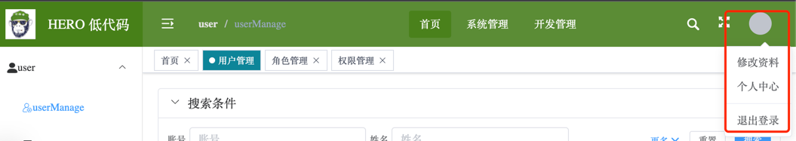

# UserDropdown 头像下拉

点击用户头像显示的下拉选，通常位于界面布局的顶部右侧，如下图所示：

## 基本使用

<preview path="../demos/user-dropdown/user-dropdown-1.vue" title="基本使用" description="通过设置 avatar 属性显示用户头像"></preview>

<preview path="../demos/user-dropdown/user-dropdown-2.vue" title="基本使用" description="如果没有头像，avatar为空时，使用 defaultAvatarText 代替头像"></preview>

<preview path="../demos/user-dropdown/user-dropdown-3.vue" title="基本使用" description="使用 dropdownItems 属性指定点击头像时的下拉选项"></preview>

## 组件 API

### Attributes 属性

| 参数 | 说明 | 类型 | 可选值 | 默认值 |
|  ----  | ----  | ----  | ----  | ----  |
| avatar | 用户头像URL | string |  | null |
| size | 用户头像大小 | number | - | 36 |
| defaultAvatarText | 没有头像时使用该字符串代替头像 | string | - | 'User' |
| dropdownItems | 下拉选列表，数组每项类型为 UserDropdownItem | UserDropdownList | - | null |

#### UserDropdownItem
| 参数 | 说明 | 类型 | 可选值 | 默认值 |
|  ----  | ----  | ----  | ----  | ----  |
| title | 下拉选文字 | string | - | |
| click | 该项点击事件 | () => void |  | |
| isDivided | 是否显示分割线 | boolean |  | false |

### Events 事件

| 事件名 | 说明 | 参数 | 返回值 |
|  ----  | ----  | ----  | ----  |
| avatar-click | 没有下拉选项时，点击头像的事件 | - | - |
